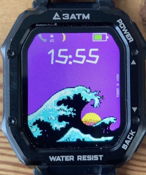

Espruino App Loader (and Apps) for  P8, ROCK, Magic 3 Smart Watches
==============================

## Installation

### ROCK and Magic3
For a brand-new watch, you need to follow the instructions [here](https://github.com/fanoush/ds-d6/tree/master/espruino/DFU/Magic3) produced by @fanoush. Also following these instructions downgrade to SoftDevice S140-6.0.0.  After that you can flash the zip file from the firmware [directory](https://github.com/jeffmer/WatchApps/tree/main/firmware).  

IMPORTANT - you need to downgrade the SoftDevice before loading my Espruino zip file. The sequence is is this: install 1) Espruino using DaFlasher 2) DFU bootloader using WEBIDE  3)  Espruino zip file from fanoush repository 4) downgrade SoftDevice to 6.0.0 5) Espruino zip in this repository. Miss any of these steps results in a temporary (wait for battery flat) or permanent brick.

This build has a modified `lcd_spi_unbuf` module. The build makes the full 8 megabytes available to Espruino applications. 

Once Espruino is installed use the [App Loader](https://jeffmer.github.io/WatchApps/) to load `Bootloader`, `Main`, `Launcher` and `Settings` followed by the apps and widgets you want.

### P8
For a brand-new P8, you need to follow the instructions [here](https://github.com/fanoush/ds-d6/tree/master/espruino/DFU/P8) produced by @fanoush to get the right bootloader required by Espruino - SDK12 with Softdevice S132 3.0. After that you can flash the zip file from the firmware [directory](https://github.com/jeffmer/WatchApps/tree/main/firmware).

This build has a modified `lcd_spi_unbuf` module that works with SPI FLASH. The build makes the full 4 megabytes available to Espruino applications. 

These provide a simple Bangle emulation environment which will let you load Bangle Apps from its App Loader. 

Someone brave can try GadgetBridge which may work.....

### Credits

@ATC1441, reverse engineered the DaFit app and wrote [DaFlasher](https://play.google.com/store/apps/details?id=com.atcnetz.paatc.patc&gl=US) which allows you to replace the firmware these watches come with.

@Fanoush, for the Espruino builds/bootloaders and his help with getting the LCD driver to work.

@gfwilliams, for [Espruino](https://www.espruino.com/) and for the Bangle App Loader used here. *If you want a hassle free watch you can program off the shelf get a Bangle.js or Bangle.js2.*

