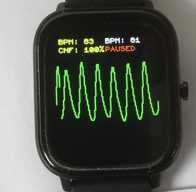

## Heart Rate Monitor

Displays PPG graph and heart rate computed by correlation in yellow and by peak detection in white - see screenshot.
Swipe right to start - left to pause.

With a good waveform, the peak detection BPM is the more accurate as the correlation BPM displays only 30 values over the range 40-200.